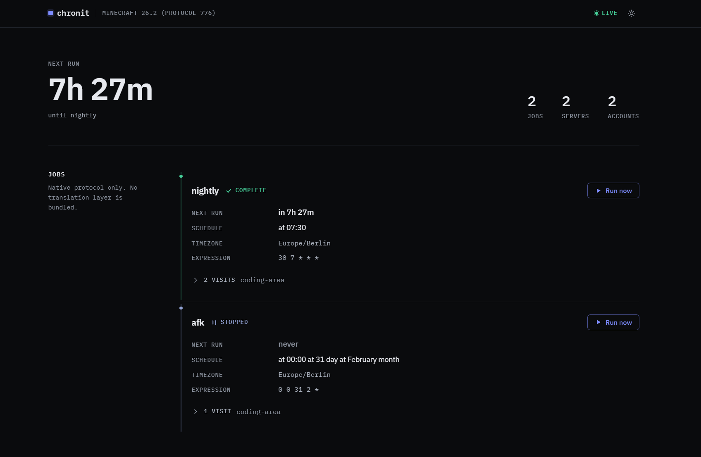

# chronit

Logs a Minecraft account into a list of Java Edition servers on a schedule, waits until it is
properly in the world, runs a configured sequence of commands, stays for a set time, then moves on
to the next server.

Built for **Minecraft 26.2 (protocol 776)**. Older versions are reachable through an optional
translation layer.



## Quick start

```bash
cp config/chronit.example.yml ./chronit.yml   # then edit it
docker compose -f docker/docker-compose.yml up -d --build
```

Authorise the Microsoft account once. The code appears in the log, or in the web interface if you
enabled it:

```bash
docker compose -f docker/docker-compose.yml run --rm chronit login main
```

Check what the schedule will actually do before leaving it unattended:

```bash
docker compose -f docker/docker-compose.yml run --rm chronit validate
```

## A job

```yaml
jobs:
  - id: nightly
    cron: "0 20 * * *"
    timezone: Europe/Berlin
    visits:
      - server: survival
        account: main
        stayFor: 30m
        onReady:
          - command: "login {{secrets.survival_password}}"
            waitFor: { chat: "(?i)successfully logged in", timeout: 10s }
          - command: "daily claim"
```

Every option is commented in [`config/chronit.example.yml`](config/chronit.example.yml). The parts
that need more than a comment are in [Configuring a visit](docs/configuration.md).

## Commands

| Command                                               | Purpose                                                                          |
|-------------------------------------------------------|----------------------------------------------------------------------------------|
| `chronit daemon`                                      | Run the built-in scheduler. The container's default command.                     |
| `chronit run <job>`                                   | Run one job and exit. For system cron, systemd timers, Kubernetes CronJobs.      |
| `chronit run --server <id> --account <id> --stay 10m` | One-off visit, useful for testing.                                               |
| `chronit login <account>`                             | Interactive Microsoft device code login.                                         |
| `chronit accounts [--refresh]`                        | Which accounts are ready, and which need a login. Non-zero exit if any need one. |
| `chronit ping <server\|host:port>`                    | Server list ping.                                                                |
| `chronit validate`                                    | Check the configuration and print the resolved schedule.                         |
| `chronit --version`                                   | Version, protocol, and whether translation is installed.                         |

## Documentation

- [Getting into a world](docs/joining.md): what a server demands before it lets a client in
- [Configuring a visit](docs/configuration.md): resource packs, readiness, commands, menu clicks, secrets
- [Scheduling and outcomes](docs/scheduling.md): daemon or external cron, stopping a run, the five outcomes
- [Accounts and tokens](docs/accounts.md): device code login, and why you rarely have to do it twice
- [Minecraft versions](docs/versions.md): `protocol: auto`, ViaVersion, retargeting the driver
- [Web interface](docs/web-interface.md): the dashboard, its design, and how it is built
- [Development](docs/development.md): building, testing, module layout
- [Deploying to a server](deploy/README.md): a self-contained folder, no source tree needed

## Running it

There are two Docker setups for two different jobs. [`docker/`](docker) builds chronit from this
source tree and is what the commands above use, so it suits development and any server you are happy
to build on. [`deploy/`](deploy/README.md) builds nothing: you copy that one folder to a server, drop
in a jar you built elsewhere along with your `chronit.yml`, and start it. Use it when the server has
no source tree, no JDK, and no reason to acquire either.

The daemon is the default because a visit is a long-lived stateful session, which suits a supervised
process better than a fire-and-forget invocation. If you would rather drive it from system cron,
`chronit run <job>` does exactly one job and exits with a status reflecting whether every visit
succeeded. Both paths run the same code; see [Scheduling and outcomes](docs/scheduling.md).

## Limitations

- The client stands still. It sends what a stationary vanilla client sends and does not wander
  around to defeat AFK kicks, so a server that kicks idle players will kick it.
- Signed chat is best effort. Commands are unaffected, but if a server rejects signed plain chat,
  set `secureChat: OFF` and use commands instead.
- The ViaVersion path has no automated tests. The tests exercise the native 26.2 path against an
  in-process server. The integration follows the documented ViaLoader API but has not been run
  against a real legacy server here.
- One account can only be on one server at a time. Logging in again invalidates the earlier session,
  so visits sharing an account are serialised. That is enforced, not merely documented.
- Menu clicks address slots, not items. There is no "click the slot holding a diamond", because slot
  indices are stable in the plugin menus this is built for, and matching on item identity would mean
  decoding the item data components the click path deliberately avoids.

## Server rules

Many servers prohibit unattended or AFK clients. Nothing here evades detection: chronit performs the
same handshakes a vanilla client performs and identifies itself with a configurable brand. Check the
rules of the servers you point it at.
